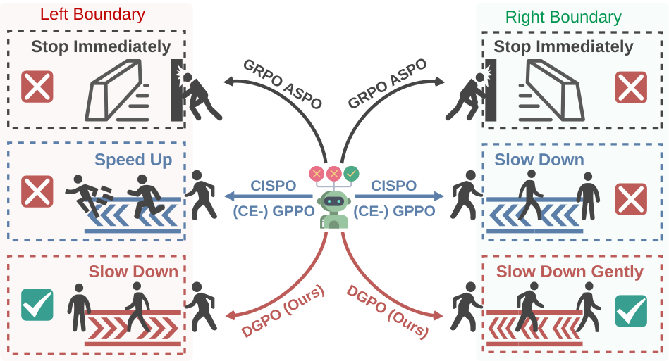
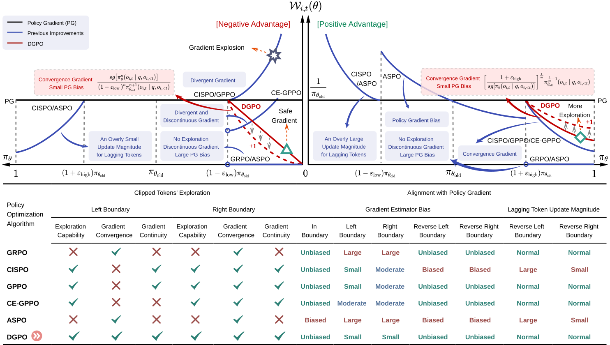

<div align="center">

# From $\log\pi$ to $\pi$: Taming Divergence in Soft Clipping via Bilateral Decoupled Decay of Probability Gradient Weight

**Decoupled Gradient Policy Optimization (DGPO)** - Official Implementation

</div>

## 📖 Abstract

Reinforcement Learning with Verifiable Rewards (RLVR) has catalyzed a leap in Large Language Model (LLM) reasoning, yet its optimization dynamics remain fragile. Standard algorithms like GRPO enforce stability via "hard clipping", which inadvertently stifles exploration by discarding gradients of tokens outside the trust region. While recent "soft clipping" methods attempt to recover these gradients, they suffer from a critical challenge: relying on *log-probability gradient* ($\nabla_{\theta} \log \pi_{\theta}$) yields divergent weights as probabilities vanish, destabilizing LLM training. 

We rethink this convention by establishing *probability gradient* ($\nabla_{\theta} \pi_{\theta}$) as the superior optimization primitive. Accordingly, we propose **Decoupled Gradient Policy Optimization (DGPO)**, which employs a decoupled decay mechanism based on importance sampling ratios. By applying asymmetric, continuous decay to boundary tokens, DGPO resolves the conflict between stability and sustained exploration. Extensive experiments across DeepSeek-R1-Distill-Qwen series models (1.5B/7B/14B) demonstrate that DGPO consistently outperforms strong baselines on various mathematical benchmarks, offering a robust and scalable solution for RLVR.

## 🎯 Key Contributions

- **Novel Perspective**: We establish the gradient of probability, rather than log-probability, as the superior optimization primitive in LLMs, with two key insights: the inherent alignment of RL objectives and the geometric symmetry of probability space.

- **DGPO Algorithm**: We propose DGPO, which leverages a decoupled adaptive decay mechanism to reconcile the exploration-stability conflict. Crucially, this design preserves gradients for clipped tokens while rigorously preventing weight divergence.

- **Comprehensive Experiments**: Extensive experiments against competitive baselines across mathematical reasoning benchmarks demonstrate the effectiveness of DGPO. Further results on diverse model scales confirm its scalability and robustness.

## 🎨 Overview

<div align="center">
  
  <p><em>Figure 1: Overview of DGPO framework</em></p>
</div>

## 🚀 Quick Start

### Installation

This implementation is based on [verl](https://github.com/volcengine/verl), a flexible and efficient RLHF framework. Please follow the verl installation guide first.

```bash
# Clone the repository
git clone https://github.com/VenomRose-Juri/DGPO-RL.git
cd DGPO-RL

# Install verl dependencies (see verl documentation for details)
pip install -r requirements.txt
```

### Running DGPO

We provide a complete example script for training with DGPO on GSM8K dataset:

```bash
bash examples/dgpo_trainer/run_deepseek-r1-distill-qwen-7b.sh
```

### Key Configuration Parameters

To enable DGPO, set the following parameters in your configuration:

```yaml
actor_rollout_ref.actor.policy_loss.ratio_clip.ratio_mode: dgpo
actor_rollout_ref.actor.policy_loss.ratio_clip.dgpo_n: 1      # Left boundary decay parameter
actor_rollout_ref.actor.policy_loss.ratio_clip.dgpo_m: 2      # Right boundary decay parameter
```

**Hyperparameter Guidelines:**
- **Default recommendation**: `dgpo_n=1, dgpo_m=2` (robust and conservative baseline)
- **For smaller models (1.5B)**: Can use `dgpo_n=2, dgpo_m=2` for better exploration
- **For larger models (7B+)**: Use `dgpo_n=1, dgpo_m=2` to maintain stability

### Example Configuration

Here's a minimal example showing how to configure DGPO:

```bash
python3 -m verl.trainer.main_ppo \
    algorithm.adv_estimator=grpo \
    data.train_files=$HOME/data/gsm8k/train.parquet \
    data.val_files=$HOME/data/gsm8k/test.parquet \
    actor_rollout_ref.model.path=deepseek-ai/DeepSeek-R1-Distill-Qwen-7B \
    actor_rollout_ref.actor.policy_loss.ratio_clip.ratio_mode=dgpo \
    actor_rollout_ref.actor.policy_loss.ratio_clip.dgpo_n=1 \
    actor_rollout_ref.actor.policy_loss.ratio_clip.dgpo_m=2 \
    actor_rollout_ref.actor.use_kl_loss=False \
    algorithm.use_kl_in_reward=False \
    trainer.total_epochs=15
```

### Full Training Script

For a complete training example, see `examples/dgpo_trainer/run_deepseek-r1-distill-qwen-7b.sh`. This script includes:
- GRPO advantage estimator configuration
- DGPO policy loss configuration
- KL loss settings
- FSDP configuration
- vLLM rollout settings
- Wandb logging setup

## 📊 Experimental Results

### Main Results

We evaluate DGPO on multiple mathematical reasoning benchmarks including AIME24, AIME25, AMC23, MATH500, Minerva, and OlympiadBench. The following table shows the comprehensive comparison with competitive baselines:

#### DeepSeek-R1-Distill-Qwen-1.5B Results

| Method | AIME24 | AIME25 | AMC23 | MATH500 | Minerva | Olympiad | **Avg.** |
|--------|--------|--------|-------|---------|---------|----------|----------|
| | A@32 / P@32 | A@32 / P@32 | A@32 / P@32 | A@32 / P@32 | A@32 / P@32 | A@32 / P@32 | A@32 / P@32 |
| GRPO | 33.2 / 71.8 | 27.7 / 49.9 | 79.5 / 94.8 | *77.6* / 90.8 | 26.1 / 48.8 | *46.3* / 64.7 | 48.4 / 70.1 |
| CISPO | 34.8 / 69.1 | 25.8 / 53.3 | 76.9 / *94.9* | 76.8 / **91.8** | 26.5 / **54.2** | 45.8 / *65.8* | 47.8 / *71.5* |
| GPPO | 29.6 / 60.5 | 23.5 / 51.9 | 73.5 / 94.1 | 76.3 / 89.1 | 26.6 / 50.0 | 43.9 / 64.2 | 45.6 / 68.3 |
| CE-GPPO | 35.1 / 70.2 | 27.7 / *55.1* | 82.5 / **95.0** | 76.7 / 90.2 | *27.8* / *50.5* | 45.6 / 63.1 | *49.2* / 70.7 |
| ASPO | *36.4* / *73.2* | *28.3* / 51.5 | *83.1* / 94.7 | 74.6 / 90.5 | 26.0 / 49.8 | 44.9 / 63.7 | 48.9 / 70.6 |
| **DGPO (Ours)** | **43.3** / **79.3** | **32.8** / **56.1** | **86.0** / **95.0** | **77.9** / *91.0* | **28.2** / 50.4 | **48.0** / **66.4** | **52.7** / **73.0** |

#### DeepSeek-R1-Distill-Qwen-7B Results

| Method | AIME24 | AIME25 | AMC23 | MATH500 | Minerva | Olympiad | **Avg.** |
|--------|--------|--------|-------|---------|---------|----------|----------|
| | A@32 / P@32 | A@32 / P@32 | A@32 / P@32 | A@32 / P@32 | A@32 / P@32 | A@32 / P@32 | A@32 / P@32 |
| GRPO | 48.2 / **82.5** | 37.4 / 60.5 | 88.1 / *96.6* | *84.8* / 92.4 | 37.4 / 57.2 | *57.2* / *73.9* | 58.9 / *77.2* |
| CISPO | 51.6 / 76.6 | *38.2* / *65.4* | **90.6** / *96.6* | 82.1 / 91.6 | 38.7 / 56.5 | 54.3 / 69.9 | *59.3* / 76.1 |
| GPPO | 43.1 / 72.5 | 31.7 / 62.5 | 85.6 / 94.9 | 83.2 / **95.4** | 33.1 / **59.3** | 53.2 / **74.3** | 55.0 / 76.5 |
| CE-GPPO | 48.7 / 76.9 | 36.4 / 60.4 | *90.5* / 95.0 | 84.3 / 93.3 | *39.0* / 55.4 | 54.9 / 72.5 | 59.0 / 75.6 |
| ASPO | *51.8* / 79.6 | 37.1 / 54.1 | 90.0 / **97.2** | 83.8 / *94.9* | 37.0 / *59.2* | 54.1 / 72.8 | 59.0 / 76.3 |
| **DGPO (Ours)** | **55.5** / *81.9* | **43.1** / **68.0** | **90.6** / *96.6* | **85.4** / 92.0 | **39.8** / 56.7 | **57.7** / 72.0 | **62.0** / **77.9** |

**Key Findings:**
- **1.5B Model**: DGPO outperforms GRPO by **+4.3%** (48.4 → 52.7) and best baseline (CE-GPPO) by **+3.5%** (49.2 → 52.7) in Avg@32
- **7B Model**: DGPO outperforms GRPO by **+3.1%** (58.9 → 62.0) and CISPO by **+2.7%** (59.3 → 62.0) in Avg@32
- DGPO demonstrates superior performance across the majority of benchmarks on both scales
- **Bold** indicates best performance, *italic* indicates second-best

### Scalability Analysis

| Method | 1.5B (A@32 / P@32) | 7B (A@32 / P@32) | 14B (A@32 / P@32) |
|--------|---------------------|-------------------|-------------------|
| GRPO | 48.4 / 70.1 | 58.9 / 77.2 | 53.6 / 67.4 |
| **DGPO** | **52.7 / 73.0** | **62.0 / 77.9** | **56.7 / 70.4** |
| *Improvement* | *+4.3 / +2.9* | *+3.1 / +0.7* | *+3.1 / +3.0* |

DGPO demonstrates consistent improvements across all model scales, confirming its scalability and robustness.

## 🔬 Algorithm Overview

### Core Idea

DGPO addresses the fundamental issue in soft clipping methods: **divergent gradient weights** when using log-probability gradients. By shifting to **probability gradients**, DGPO ensures:

1. **Gradient Preservation**: Maintains gradients for clipped tokens to enable exploration
2. **Stability Control**: Ensures convergent weights at boundaries via adaptive decay
3. **Minimal Bias**: Minimizes deviation from the true policy gradient

### Mathematical Formulation

The DGPO weighting function is defined as:

$$
\mathcal{W}^{\mathrm{DGPO}}_{i,t}(\theta) = \begin{cases} 
    C_{\mathrm{left}} \cdot \pi_{\theta}^{n}(o_{i,t}|q,o_{i,<t}), & \text{if LN (left boundary)}, \\
    C_{\mathrm{right}} \cdot \pi_{\theta}^{-\frac{1}{m}}(o_{i,t}|q,o_{i,<t}), & \text{if HP (right boundary)}, \\
    \frac{1}{\pi_{\theta_{\mathrm{old}}}}, & \text{otherwise}.
\end{cases}
$$

Where:
- **LN**: Low IS ratio with negative advantage (left boundary)
- **HP**: High IS ratio with positive advantage (right boundary)
- $n, m \in \mathbb{Z}^{+}$: Hyperparameters controlling decay rate
- $C_{\mathrm{left}}$ and $C_{\mathrm{right}}$: Constants ensuring continuity

<div align="center">
  
  <p><em>Figure 2: DGPO method illustration</em></p>
</div>

### Key Advantages

1. **Symmetric Stability**: Polynomial decay on left boundary and reciprocal radical decay on right boundary ensure stable training
2. **Exploration Enhancement**: Preserves gradients for boundary tokens, enabling sustained exploration
3. **Theoretical Guarantees**: Mathematically guarantees gradient continuity and prevents weight divergence

## 📁 Project Structure

```
dgpo/
├── verl/
│   ├── trainer/ppo/
│   │   └── core_algos.py          # DGPO implementation
│   ├── workers/actor/
│   │   └── dp_actor.py            # Actor with DGPO support
│   └── trainer/config/actor/
│       └── actor.yaml             # Configuration file
├── examples/
│   └── dgpo_trainer/
│       └── run_deepseek-r1-distill-qwen-7b.sh        # Example training script
└── README.md
```

## 🔧 Implementation Details

### Code Location

- **Core Algorithm**: `verl/trainer/ppo/core_algos.py` (lines 920-932)
- **Actor Integration**: `verl/workers/actor/dp_actor.py` (uses `compute_policy_loss` with DGPO mode)
- **Configuration**: `verl/trainer/config/actor/actor.yaml` (ratio_clip section)

### Key Implementation Points

1. DGPO is integrated into the existing PPO framework via the `ratio_clip_config.ratio_mode` parameter
2. When `ratio_mode="dgpo"`, the algorithm applies the decoupled decay mechanism
3. The implementation supports both FSDP and Megatron backends

## 🔍 Related Work

This work builds upon and improves several existing methods:

- **GRPO** (Group Relative Policy Optimization): The baseline hard-clipping method
- **CISPO** (Continuous Importance Sampling Policy Optimization): Soft clipping with constant weights
- **GPPO** (Gradient Preserving Policy Optimization): Soft clipping focusing on boundary cases
- **CE-GPPO** (Controlled Exploration GPPO): GPPO with hyperparameter scaling
- **ASPO** (Asymmetric Soft Policy Optimization): Reverse ratio approach

For more details on the theoretical analysis and comparison, please refer to our paper.

## 🙏 Acknowledgments

This implementation is built on top of [verl](https://github.com/volcengine/verl), a flexible and efficient RLHF framework. We thank the verl community for their excellent infrastructure.

## 🐛 Troubleshooting

### Common Issues

1. **Training Instability**: If you encounter training collapse, try reducing `dgpo_n` or `dgpo_m` values. For larger models, use more conservative settings (e.g., `n=1, m=2`).

2. **Memory Issues**: Ensure you have sufficient GPU memory. Consider using gradient checkpointing and parameter offloading:
   ```yaml
   actor_rollout_ref.model.enable_gradient_checkpointing: True
   actor_rollout_ref.actor.fsdp_config.param_offload: True
   ```

3. **Convergence Speed**: If training is too slow, you can increase the learning rate slightly, but monitor for stability.

### Performance Tips

- Use `use_remove_padding=True` for better memory efficiency
- Enable `use_fused_kernels=True` if your model supports it
- Adjust `ppo_mini_batch_size` and `ppo_micro_batch_size_per_gpu` based on your GPU memory


## 📝 License

This project follows the same license as verl. Please refer to the verl repository for license details.

---

**Note**: This is the official implementation of DGPO. For more details, please refer to our paper.
